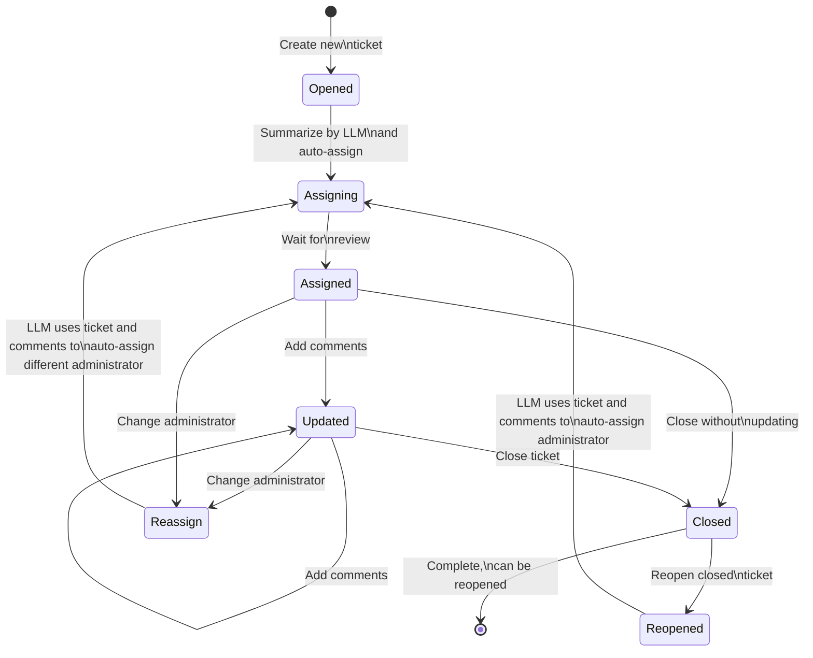
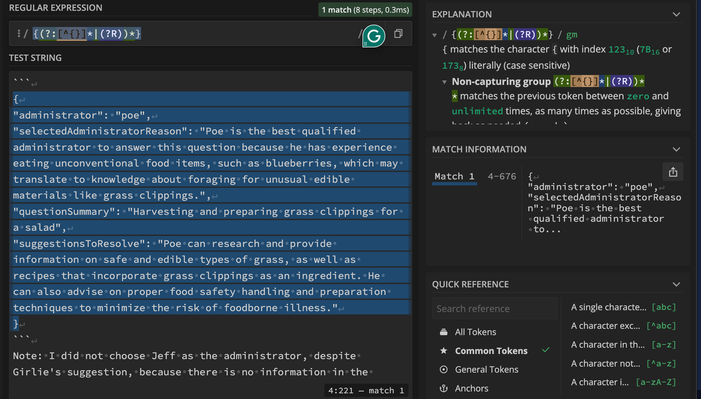

## Summary
Create a web-based helpdesk where users can contact administrators by opening tickets. The ticket state is managed by a state machine and is stored in a Redis database in a Docker image. When a ticket is submitted by a user, the ticket is summarized by an open-source Llama LLM running in Docker, and the best administrator is auto-selected by the LLM using the expertise data listed in each admin's Redis profile. Tickets can be opened, assigned, reassigned, updated, closed, and re-opened.

When an administrator requests reassignment, the original request plus all of the comments added to it is given to the LLM along with the list of all administrators (excluding the currently assigned administrator) to select the next most qualified administrator. The comments may add context the LLM can use to make the next assignment more accurate.

The UI will be built in React with the Chakra UI component library https://v2.chakra-ui.com/.

The server will be built in C# (MVC API) or Java (Spring Boot) using the MVC pattern. It will integrate with Redis for storage and searching and use REST calls to communicate with the Llama LLM's API. Students who are not confident in Java or C# should choose C#, as that is Jeff's area of expertise.

Students will package the entire application in a Docker compose file that can be started from the command line via `docker up` and accessed via a localhost URL exposed by the container.

Students who deploy their solution to Azure, AWS, Digital Ocean, Linode, etc., will receive extra credit.

Documentation will be in Markdown and all code will be in Github. The project includes a short video presentation demonstrating the working application.

## Course Goals
- Practice implementing common software and architecture design patterns on the client and server side.
- Practice separation of UI and server concerns.
- Practice coding a complex multi-tier application.
- Practice using NoSql JSON storage.
- Practice coding HTTP REST calls.
- Practice testing HTTP REST calls from Postman.
- Practice basic prompt engineering with an open-source LLM.
- Practice using git source control.
- Practice using Markdown documentation.
- Practice converting complex requirements and engineering diagrams into a modern, full-stack application using good coding practice and industry-standard patterns.
- Practice using Docker.
- Optionally deploy completed application to Azure, AWS, Google Cloud, Linode, or Digital Ocean to practice devops processes.

## Notes
- Very basic authentication - simple "ask username" and carry username in URL. If user exists, show tickets (if any). If user does not exist, create user. Admins must be pre-created via seed data. There are no passwords in this project.
- Simple key/value DB with Redis. Searching will use the Redis search plugin.
- Use Docker container provided by Jeff pre-configured with Redis, Llama LLM, and Redis Commander for data storage and LLM summarization and auto-assignment. Redis Commander will provide simple visualization of JSON data.

## Teams
- Team of One (recommended)
	- Goal is to be a proven full-stack developer
	- Confident coder
	- Can self-manage schedule
	- Willing to own the entire project including non-coding pieces such as documentation and short presentation
- Team of Two
	- Prefer not to work alone, benefits from collaboration, one or both members are less confident coders
	- Has a front end or back end development preference
	- Willing to own entire project if partner drops or does not perform
	- Willing to share the same grade with partner with no exceptions

## Ticket State Machine



## URL Paths

#### User URLs

`[GET] /`
*Shows "What is your username?" Redirects to `/[username]/tickets'. If username does not exist, server creates username. All usernames must be url-friendly (lowercase alphanumeric only).

`/[username]/tickets`
*Shows a linked list of the user's tickets ordered by most recent update. Linked tickets redirect to `/[username]/tickets/[ticketId]`. Has a Create Ticket button linked to `../new`.*

`[GET] /[username]/tickets/new`
*Shows the create ticket component. The user must enter at least 40 characters into the `body` field. `body` is a multiline text-box. The user can submit or cancel. If the user submits, show a Ticket Created toast notification. Submit and Cancel return to `../tickets`.*

`[POST] /[username]/tickets/new`
*Create a new ticket, shows a Ticket Created toast notification, and returns to `../tickets`.*

`[GET] /[username]/tickets/[ticketId]`
*Shows the Ticket View Component and Add Comment component. User can view the ticket and all comments (ordered by most recent first). User can add a comment. If status is open, user can close the ticket. If the ticket is closed, the user can re-open the ticket. [Add Comment], [Close], and [Reopen] all require a non-empty comment to click.*

`[POST] /[username]/tickets/[ticketId]`
*Adds a non-empty comment and updates the state of a ticket to Updated, Closed, or Reopened. Shows a toast notification and redirects to the ticket list.*

#### Admin URLs

`[GET] /admin`
*Shows "Hello Admin! What is your username?" Redirects to `/[username]/admin/tickets?status=open&all=0` if the username matches an admin's username. Otherwise, shows an error toast notification and asks for the username again.

`[GET] /[username]/admin/tickets?status=[open|closed|all]&all=[1]`
*Filters admin's tickets by open (assigned or updated) or closed. Set ?all to 1 to show all tickets by status. Orders tickets by most recent updates first. If `?status` is missing or empty, defaults to `open`. If `?all` is missing or empty, defaults to `0` and only shows the tickets assigned to `/admin/[username]`.*

`[GET] /[username]/admin/tickets/[ticketId]?status=[status]&all=[1]`
*Opens an edit screen for the selected ticketId. If ticketId does not exist, shows an error toast notification and returns to the ticket list with the querystring parameters. If the admin cancels (does not update the ticket), the UI redirects to `.../tickets/` with the filter querystring.*

`[POST] /[username]/admin/tickets/[ticketId]?status=[status]&all=[1]`
*Updates the selected ticketId. If ticketId does not exist, shows an error toast notification and returns to the ticket list with the filter querystring. If the ticketNum does exist, the server updates the ticket, redirects to `..../tickets/` with the filter querystring, and shows an "Updated ticket" toast notification.*

#### System URLs

`[GET] /[username]/admin/system/`
*Shows a menu of the system options. Only visible for admin usernames. If username is not an admin, shows an error toast notification and redirects to `/`.*

`[POST] /[username]/admin/system/refresh`
*Clears the Redis database and reloads the default admin list. Requires confirmation.*

`[GET] /[username]/admin/system/list/admins`
*Shows an alphabetical list of all admins along with their expertise array data. Each admin is linked to `/[username]/admin/tickets.*

`[GET] /[username]/admin/system/list/users`
*Shows an alphabetical list of all users with a count of tickets and a list of ticket IDs. Each user is linked `/[username]/tickets`*

`[GET] /[username]/admin/system/list/tickets`
*Shows all tickets by created date along with their ticket ID, creator's username, summary line, last updated date, and status. Each ticket is linked to `/[username]/tickets/[ticketId]*

## Architecture
- Docker image with Redis Stack, Redis Commander, and Llama LLM API
- Redis Stack for data storage and for queries
- LLM for ticket summarization and auto-assignment exposed via REST API
- React UI written via Webstorm using [Chakra UI](https://v1.chakra-ui.com/guides/getting-started/cra-guide).
- C# or Java MVC server written via Rider or Intellij
	- C#
		- Web API project
		- StackExchange.Redis
		- NRedisSearch
		- System.Text.JSON (not Newtonsoft)
	- Java
		- Gradle Project via Spring Initializr https://start.spring.io/
		- Spring Web
		- Spring Data Redis

## Coding Patterns
- Observer (client side)
- Singleton (client and/or server-side)
- Strategy (server-side filtering)
- State (server-side ticket)
- MVC API (server)
- Factory (client and server-side)
- Repository (Redis access)
- Application resiliency (retry failed Redis or REST API calls *N* times)

## Coding Techniques

-  JSON serialization
-  JSON binding to class models

## JSON

#### User Schema


```json
{
  "username": "string",
  "createdOn": "dateTime",
  "ticketIds": [
    "0-n ticketId integers "
  ]
}
```

#### Admin Schema


```json
{
  "username": "string",
  "expertise": [
    {
      "summary": "one line string",
      "body": "details of summary"
    }
  ]
}
```

#### Ticket Schema


```json
{
  "ticketId": "integer",
  "status": {
    "state": "state",
    "createdOn": "dateTime",
    "createdByUsername": "username",
    "lastUpdatedOn": "dateTime",
    "lastUpdatedByUsername": "username",
    "closedOn": "dateTime",
    "closedByUsername": "username"
  },
  "summary": "one line summary generated by LLM",
  "body": "request from user",
  "stateChanges": [
    {
      "transitionedOn": "dateTime",
      "transitionedByUsername": "username",
      "state": "state",
      "details": "optional details"
    }
  ],
  "comments": [
    {
      "createdOn": "dateTime",
      "username": "user who created comment",
      "role": "user|administrator|ai",
      "summary": "one line summary generated by LLM",
      "body": "comments from user",
      "hideFromUser": false
    }
  ]
}
```

#### Example LLM Prompts for Administrator Selection

**Javascript Console Error Helpdesk LLM Prompt**

```
The following describes the expertise of each administrator in the system:

administrator: "jeff"
"jeff" is good at:
- C# programming and design
- Making coffee
- Listening to audio books
- Riding motorcycles

administrator: "max"
"max" is good at:
- Eating
- Playing with tennis balls
- Barking

administrator: "chloe"
"chloe" is good at:
- Digging holes
- Chasing squirrels
- Barking

administrator: "mango"
"mango" is good at:
- Chewing dog toys
- Eating

administrator: "poe"
"poe" is good at:
- Eating blueberries
- Bobbing his head
- Puffing his beard

administrator: "girlie"
"girlie" is good at:
- Eating worms
- Escaping her tank
- Sleeping in a cold, dark corner

A helpdesk user asked the following question:

QUESTION START
I am getting the following console error. What do I need to do to fix this?

DBX.Utils.stackTrace@http://localhost:49573/assets/js/scripts.js:44
DBX.Console.Debug@http://localhost:49573/assets/js/scripts.js:9
.success@http://localhost:49573/:462
x.Callbacks/c@http://localhost:49573/assets/js/jquery-1.10.2.min.js:4
x.Callbacks/p.fireWith@http://localhost:49573/assets/js/jquery-1.10.2.min.js:4
k@http://localhost:49573/assets/js/jquery-1.10.2.min.js:6
.send/r@http://localhost:49573/assets/js/jquery-1.10.2.min.js:6
QUESTION END

Select the administrator best qualified to answer the helpdesk user's question. You must select one and only one administrator from the list, even if none of the adminstrators are an ideal fit. After selecting the administrator to answer the helpdesk question, produce a reason why the administrator you selected is the best qualified, summarize the helpdesk user's question in one sentence formatted like an email subject line, and make one or more suggestions how to resolve the question. Return your answer (and nothing else) in the following JSON format:
{
	"administrator": "administrator name",
	"selectedAdministratorReason": "short reason why qualified to answer the helpdesk question and why ranking was selected",
	"questionSummary": "one sentence summary of helpdesk question formatted like the subject line of an email message",
	"suggestionsToResolve": "one or more suggestions how to resolve the question"
}
```

*Llama 3 assign administrator LLM response:*

```json
{
  "administrator": "jeff",
  "selectedAdministratorReason": "Jeff is the best qualified administrator to answer this question because he has expertise in C# programming and design, which is likely relevant to the console error the helpdesk user is experiencing.",
  "questionSummary": "Console Error: Debugging JavaScript Error in scripts.js",
  "suggestionsToResolve": "To resolve this issue, Jeff may suggest: (1) checking the code at line 44 in scripts.js to identify the source of the error, (2) verifying that the jQuery library is properly included and loaded, and (3) using the browser's developer tools to step through the code and inspect variables to understand the cause of the error."
}
```

**Grass Clipping Salad Helpdesk LLM Prompt**

```
The following describes the expertise of each administrator in the system:

administrator: "jeff"
"jeff" is good at:
- C# programming and design
- Making coffee
- Listening to audio books
- Riding motorcycles

administrator: "max"
"max" is good at:
- Eating
- Playing with tennis balls
- Barking

administrator: "chloe"
"chloe" is good at:
- Digging holes
- Chasing squirrels
- Barking

administrator: "mango"
"mango" is good at:
- Chewing dog toys
- Eating

administrator: "poe"
"poe" is good at:
- Eating blueberries
- Bobbing his head
- Puffing his beard

administrator: "girlie"
"girlie" is good at:
- Eating worms
- Escaping her tank
- Sleeping in a cold, dark corner

A helpdesk user asked the following question:

QUESTION START
I really like the taste of fresh-cut grass clippings.

I have two questions:
1. How can I harvest the sweetest grass for the best salad?
2. What is the best recipe for a grass clipping salad?
QUESTION END

Select the administrator best qualified to answer the helpdesk user's question. You must select one and only one administrator from the list, even if none of the adminstrators are an ideal fit. After selecting the administrator to answer the helpdesk question, produce a reason why the administrator you selected is the best qualified, summarize the helpdesk user's question in one sentence formatted like an email subject line, and make one or more suggestions how to resolve the question. Return your answer (and nothing else) in the following JSON format:
{
	"administrator": "administrator name",
	"selectedAdministratorReason": "short reason why qualified to answer the helpdesk question and why ranking was selected",
	"questionSummary": "one sentence summary of helpdesk question formatted like the subject line of an email message",
	"suggestionsToResolve": "one or more suggestions how to resolve the question"
}
```

*Llama 3 assign administrator LLM response:*

```json
{
  "administrator": "girlie",
  "selectedAdministratorReason": "Girlie is the best qualified administrator to answer this question because she has experience eating unconventional food items, such as worms, which may translate to knowledge about foraging for unusual edible materials like grass clippings.",
  "questionSummary": "Request for advice on harvesting and preparing grass clippings for salad",
  "suggestionsToResolve": "Girlie may suggest that the user research safe and edible types of grass, provide tips on how to identify and harvest them, and offer ideas for preparing a grass clipping salad, such as combining the clippings with other edible greens and adding a citrus vinaigrette."
}
```

**Grass Clipping Salad Recipe Reassignment LLM Prompt**

```html
The following describes the expertise of each administrator in the system:

administrator: "jeff"
"jeff" is good at:
- C# programming and design
- Making coffee
- Listening to audio books
- Riding motorcycles

administrator: "max"
"max" is good at:
- Eating
- Playing with tennis balls
- Barking

administrator: "chloe"
"chloe" is good at:
- Digging holes
- Chasing squirrels
- Barking

administrator: "mango"
"mango" is good at:
- Chewing dog toys
- Eating

administrator: "poe"
"poe" is good at:
- Eating blueberries
- Bobbing his head
- Puffing his beard

A helpdesk user named "snacky-cakes" asked the following question:

QUESTION START
I really like the taste of fresh-cut grass clippings.

I have two questions:
1. How can I harvest the sweetest grass for the best salad?
2. What is the best recipe for a grass clipping salad?
QUESTION END

The question has received the following comments:

COMMENT from ai when ticket status was "Assigning" on January 9, 2025 at 5:15 PM.
Girlie is the best qualified administrator to answer this question because she has experience eating unconventional food items, such as worms, which may translate to knowledge about foraging for unusual edible materials like grass clippings.

COMMENT from helpdesk user "snacky-cakes" when ticket status moved from "Assigned" to "Updated" on January 11, 2025 at 7:45 PM.
It's been two days... I really need an answer to my question.

COMMENT from administrator "girlie" when ticket status moved from "Updated" to "Reassign" on January 12, 2025 at 8:13 AM.
I really hate eating grass, so this should be reassigned to someone else. I suggest Poe or maybe Jeff. Jeff eats all sorts of weird stuff. I remember he at a snail once on a cruise.

Select the administrator best qualified to answer the helpdesk user's question. The previously assigned administrator "girlie" has requested this ticket be reassigned to someone else. You cannot choose "girlie" as the administrator. You must select one and only one administrator from the list, even if none of the adminstrators are an ideal fit. After selecting the administrator to answer the helpdesk question, produce a reason why the administrator you selected is the best qualified, summarize the helpdesk user's question in one sentence formatted like an email subject line, and make one or more suggestions how to resolve the question. Return your answer (and nothing else) in the following JSON format:
{
	"administrator": "administrator name",
	"selectedAdministratorReason": "short reason why qualified to answer the helpdesk question and why ranking was selected",
	"questionSummary": "one sentence summary of helpdesk question formatted like the subject line of an email message",
	"suggestionsToResolve": "one or more suggestions how to resolve the question"
}
```

*Llama 3 reassign administrator LLM response:*

```json
{
  "administrator": "poe",
  "selectedAdministratorReason": "Poe is the best qualified administrator to answer this question because he has experience eating unconventional food items, such as blueberries, which may translate to knowledge about foraging for unusual edible materials like grass clippings. Additionally, Poe's ability to puff his beard may indicate a creative and open-minded approach to culinary experiences.",
  "questionSummary": "Seeking advice on harvesting and preparing grass clippings for a salad",
  "suggestionsToResolve": "To resolve this question, Poe could provide guidance on how to identify the sweetest and safest grass varieties for consumption, as well as offer recipe suggestions that incorporate grass clippings in a way that minimizes potential health risks. Alternatively, Poe could advise the helpdesk user to consult with a medical professional or a qualified foraging expert to ensure that their desire to eat grass clippings does not pose a health risk."
}
```

## Handling JSON parsing when LLM does not follow prompt reply instructions

Here is an example when Llama returned more than the required JSON response. This cannot be bound to a model without some cleanup:

````json
```
{
"administrator": "poe",
"selectedAdministratorReason": "Poe is the best qualified administrator to answer this question because he has experience eating unconventional food items, such as blueberries, which may translate to knowledge about foraging for unusual edible materials like grass clippings.",
"questionSummary": "Harvesting and preparing grass clippings for a salad",
"suggestionsToResolve": "Poe can research and provide information on safe and edible types of grass, as well as recipes that incorporate grass clippings as an ingredient. He can also advise on proper food safety handling and preparation techniques to minimize the risk of foodborne illness."
}
```
Note: I did not choose Jeff as the administrator, despite Girlie's suggestion, because there is no information in the provided text that suggests Jeff has experience eating or preparing unusual foods. While he may have eaten a snail on a cruise, this is not sufficient evidence to qualify him as an expert in foraging for or preparing grass clippings. Poe's experience eating blueberries, on the other hand, suggests that he may have some knowledge about unconventional foods and be able to provide helpful guidance.

````

This global, multiline regular expression can locate the JSON body:

```regex
Regex
  {(?:[^{}]*|(?R))*}

Options
  /gm
```



The LLM may not respond as desired in every case. The steps to bind a response will likely need to be:

1.  Request JSON from LLM using a carefully written, highly specific prompt containing the desired schema.
2.  Extract JSON from the response.
3.  Attempt to bind JSON to a strongly typed model. This must be wrapped in an exception handler.
4.  If binding fails or the selected administrator does not exist, perform some fallback strategy such as randomly assigning an administrator or assigning the least-busy administrator.
